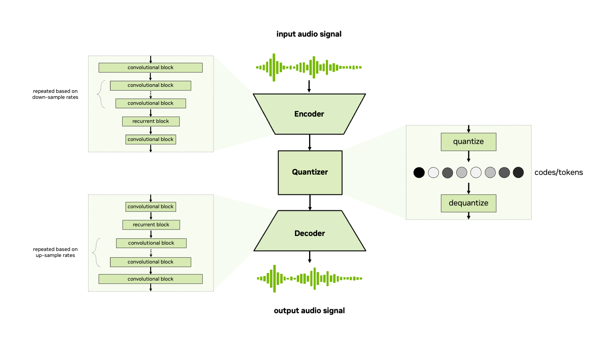

[Image source](https://docs.nvidia.com/nemo-framework/user-guide/latest/nemotoolkit/tts/models.html#audio-codec)

স্পিচ টু স্পিচ LLM এর অন্যতম গুরুত্বপূর্ণ একটা অংশ হলো [অডিও কে টোকেনাইজ](https://ravinkumar.com/GenAiGuidebook/audio/audio_tokenization.html#semantic-tokens) করা। অডিও কে টোকেনাইজ করা হয় নিউরাল অডিও কোডেক এর মাধ্যমে। এখানে আমরা দেখবো কিভাবে  নিউরাল অডিও কোডেক কাজ করে. উপরে আমরা যে ছবি দেখতে পাচ্ছি এটা উরাল অডিও কোডেক এর হাই-লেভেল আর্কিটেকচার। এই আর্কিটেকচার এর বিভিন্ন অংশগুলো কিভাবে কাজ করে সেটা বোঝার চেষ্টা করব।

## Encoder

এই অংশে অডিও ডাটা কে কিছু এক ডাইমেনশন কনভোলুশনাল লেয়ার মধ্যে দিয়ে pass করে অডিও ডাটা কে কিছুটা কমপ্রেস করা হয়। এই কমপ্রেস অডিও কে বলা হয় ল্যাটেন্ট স্পেস বা ল্যাটেন্ট ভেক্টর। [Check encoder block of Figure 2 in SEANet](https://arxiv.org/pdf/2009.02095)

এই ল্যাটেন্ট ভেক্টর কোয়ান্টাইজার এ ইনপুট হিসেবে ব্যবহার হয়।

## ভেক্টর কোয়ান্টাইজেশন কী?

**ভেক্টর কোয়ান্টাইজেশন** হলো এমন একটি প্রক্রিয়া যা:

- [Continuous-valued](https://en.wikipedia.org/wiki/Continuous_or_discrete_variable) ভেক্টরগুলিকে (যেমন নিউরাল এনকোডার থেকে পাওয়া ফিচার এটাকে [লেটেণ্ট ভেক্টরও](https://en.wikipedia.org/wiki/Latent_space) বলা হয়)
- একটি নির্দিষ্ট কোডবুকের কাছাকাছি [ডিসক্রিট](https://www.mathsisfun.com/data/random-variables-continuous.html) ভেক্টরের সাথে **ম্যাপ** করে।


আমরা একটি কোডবুক চিন্তা করি যার কোডবুক সাইজ ৫
```py
code_book_values = [2, 4, 6, 8, 9]
code_book_indexs = [0, 1, 2, 3, 4]
```

এখন আমরা কিছু ১ সাইজের ৪ টা লেটেণ্ট ভেক্টর চিন্তা করি,

```py
latent_vector_value1 = [3.4]
latent_vector_value2 = [11]
latent_vector_value3 = [6.1]
latent_vector_value4 = [6]
```
এখন আমরা [3.4] কে code_book_values এর সব ভেলুর সাথে তুলনা করব এবং [3.4] এর সবথেকে কাছের কোডবুক ভালু ও তার সংশ্লিষ্ট index বের করবো। আমরা দেখতে পাচ্ছি যে [3.4] এর সবথেকে কাছের কোডবুক ভেলু হচ্ছে `4`কারণ `4` ও `3.4` এর মাঝে দূরত্ব (আমরা যদি সংখ্যা দুইটি বিয়োগ করি) সব থেকে কম এবং এটার ইনডেক্স `1`

একই ভাবে,

- লেটেন্ট ভালু ১১ এর সবথেকে কাছের কোডবুক ভেলু ৯, ইনডেক্স ৪
- লেটেন্ট ভালু ৬.১ এর সবথেকে কাছের কোডবুক ভেলু ৬, ইনডেক্স ২
- লেটেন্ট ভালু ৬ এর সবথেকে কাছের কোডবুক ভেলু ৬, ইনডেক্স ২

উপরের উদাহরণে `code_book_values` ই হল অডিও টোকেন বা কোডেক আর ইনডেক্স হলো প্রতিটা অডিও টোকেন এক্সেস করার জন্য উনিক ভেলু.

বোঝার সুবিধার জন্য আমরা কোডবুক ভেলু ভেক্টর এবং ল্যাটেণ্ট ভেলু ভেক্টর কে একটা সিঙ্গেল নাম্বার দিয়ে রিপ্রেসেন্ট করেছি।  কিন্তু বাস্তবে এগুলো আসলে সিঙ্গেল কোনো ভেলু না।  দুইটাই মাল্টিপুল velued [ভেক্টর](https://www.mathsisfun.com/algebra/vectors.html) নিয়ে গঠিত। সিঙ্গেল ভেলুর ক্ষেত্রে আমার যেমন দুইটা সংখ্যা বিয়োগ করে কোডবুক থেকে কাছের কোডেক খুঁজে বের করতেছি ভেক্টরের ক্ষেত্রেও আমরা একই কাজ করতে পারি।

এই ক্ষেত্রে আমরা ব্যবহার করতে পারি [Euclidean distance](https://en.wikipedia.org/wiki/Euclidean_distance) এই ইউক্লিডিয়ান ডিস্ট্যান্স ভ্যালু থেকে আমার বের করতে পারো দুইটা ভেক্টর কতটা কাছাকাছি।  দুটিতে ভেক্টরের  ইউক্লিডিয়ান ডিস্ট্যান্স যত বেশি হবে তারা ততো কাছাকাছি।  আর ইউক্লিডিয়ান ডিস্ট্যান্স যত বেশি হবে তারা ততো দূরে


### ভেক্টর কোয়ান্টাইজেশনের কে আমরা যদি গাণিতিক ভাবে বোঝার চেষ্টা করি তার তাহলে তার সাধারণ ধাপ

ধরা যাক, আপনার কাছে আছে:

- একটি ল্যাটেন্ট ভেক্টর `z`, যার আকার: `[B, T, D]`
  (B = ব্যাচ, T = সময়, D = ফিচার ডাইমেনশন)
- একটি কোডবুক, যার আকার: `[K, D]`
  (K = কোডবুকে মোট ভেক্টরের সংখ্যা)

### ধাপে ধাপে:

1. **প্রতিটি ল্যাটেন্ট ভেক্টর এবং কোডবুক ভেক্টরের মধ্যে দূরত্ব নির্ণয় করো**:

$$
D = \text{dist}_{i,j} = \| z_i - c_j \|^2
$$

2. **নিকটতম কোডবুক ভেক্টর খুঁজে বের করো**:

$$
\text{idx}_i = \arg\min_j(D)
$$

3. **মূল ভেক্টরকে কোডবুক ভেক্টর দ্বারা প্রতিস্থাপন করো**:

$$
q_i = c_{\text{idx}_i}
$$


এই প্রক্রিয়ার মাধ্যমে অডিও, ইমেজ বা ভাষার ল্যাটেন্ট ফিচারগুলোকে কম বিটরেটে, আরও দক্ষ এবং অর্থপূর্ণ ডিসক্রিট রূপে প্রকাশ করা যায়।

---

## ভেক্টর কোয়ান্টাইজেশন কেন ব্যবহার করা হয়?

ভেক্টর কোয়ান্টাইজেশন ধারাবাহিক ল্যাটেন্ট ভেক্টরগুলিকে **ডিসক্রিট টোকেনে** রূপান্তর করে।

এটি বিশেষভাবে উপকারী:

- **কম্প্রেশন** এর জন্য (ব্যান্ডউইথ/বাইটরেট কমানোর জন্য)
- **অডিও ল্যাঙ্গুয়েজ মডেল ট্রেনিং** এর জন্য (যেমন AudioLM, EnCodec)
- **ডিসক্রিট রিপ্রেজেন্টেশন লার্নিং** এর জন্য (যেমন VQ-VAE)

---

## Residual Vector Quantization কী?

Residual Vector Quantization (RVQ) হলো Vector Quantization এর একটি উন্নত সংস্করণ, যেখানে একাধিক স্তরে ধাপে ধাপে কোয়ান্টাইজ করা হয়। এখানে [Residual](https://en.wikipedia.org/wiki/Residual_neural_network) টেকনিক ব্যবহার করা হয় যার ফলে আরো বেটার কোড ভ্যালু approximate করতে পারে।


## Decoder

ডিকোডার এ ঠিক এনকোডের এর এর উল্টা কাজ হয়। এখন ইনপুট হিসাবে আসে অডিও টোকেন / কোড। ডিকোডার এই অডিও টোকেন থেকে মূল অডিও রি-কনস্ট্রাক্ট করে।

## ট্রেনিং টাইমে কী হয়?

Encoder, Quantizer, Decoder সব একসাথে train হয়

মূল অডিও vs reconstructed অডিওর মধ্যে পার্থক্য হিসেব করে loss বের করা হয়

এই loss কমিয়ে মডেল শেখে কীভাবে অডিও টোকেন বানালে reconstruct করা যায়


## Summary

| ধাপ | ইনপুট | আউটপুট | উদ্দেশ্য |
|----|------|--------|------|
Encoder | waveform | latent features | দরকারি ফিচার খুঁজে বের করা
Quantizer | latent | discrete tokens | কম সাইজে represent করা
Decoder | tokens | reconstructed waveform | মূল অডিওর কাছাকাছি recreate করা


আমরা যখন কোনো নতুন অডিও কে নিউরাল অডিও কোডেক দিয়ে tokenize করবো তখন কোডবুক এর বেস্ট ভেলু কোথায় থেকে পাবো? যেটা আমাদের ইনপুট অডিও কে বেস্ট ওয়ে তে tokenize করবো?

বেস্ট ভেলু কে ট্রেনিং টাইম এ লার্ন করবে।  ট্রেনিং এর শুরু তে আমরা ল্যাটেন্ট ভেক্টর, কোডবুক কে Random ভ্যালু দিয়ে ইনিটিয়ালাইজ করবো। যেহেতু নিউরাল অডিও কোডেক মডেল অনেক অডিও ডাটা দিয়ে ট্রেনং করা হয়।  এবং এই ট্রেনিং সময় ই কোডবুক এর ভ্যালুগুলো লার্ন করবে।


## Referances

- [SEANet: A Multi-modal Speech Enhancement Network](https://arxiv.org/pdf/2009.02095)
- [Audio Codec](https://docs.nvidia.com/nemo-framework/user-guide/latest/nemotoolkit/tts/models.html#audio-codec)
- [Residual Quantization with Implicit Neural Codebooks](https://arxiv.org/abs/2401.14732)
- [Audio tokenization](https://ravinkumar.com/GenAiGuidebook/audio/audio_tokenization_in_practice.html)
