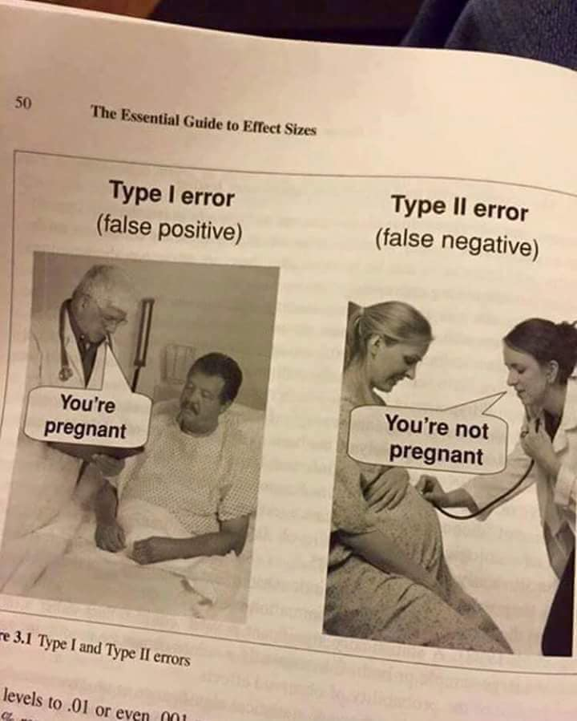

#### Type 1, Type 2 error

একটা বাইনারি ক্লাসিফায়ার চিন্তা করি 

- `False Positive:` আসলে পজিটিভ না কিন্তু মডেল বলতেছে পজিটিভ (`Type - I error`)
- `False Negative:` আসলে নেগেটিভ না কিন্তু মডেল বলতেছে নেগেটিভ (`Type - II error`)

--- 

- `True Positive:` আসলেই পজিটিভ এবং মডেল ও পজেটিভ বলতেছে 
- `True Negative:` আসলেই নেগেটিভ এবং মডেল ও নেগেটিভ বলতেছে 

#### Visualization
- [Check the image from wiki](https://en.wikipedia.org/wiki/Precision_and_recall#/media/File:Precisionrecall.svg)
- Exmple -2:
  - 

## Referances
- [False_positives_and_false_negatives](https://en.wikipedia.org/wiki/False_positives_and_false_negatives)
- [Precision and recall](https://en.wikipedia.org/wiki/Precision_and_recall)
- [precision-and-recall spam or not spam example](https://developers.google.com/machine-learning/crash-course/classification/precision-and-recall)
